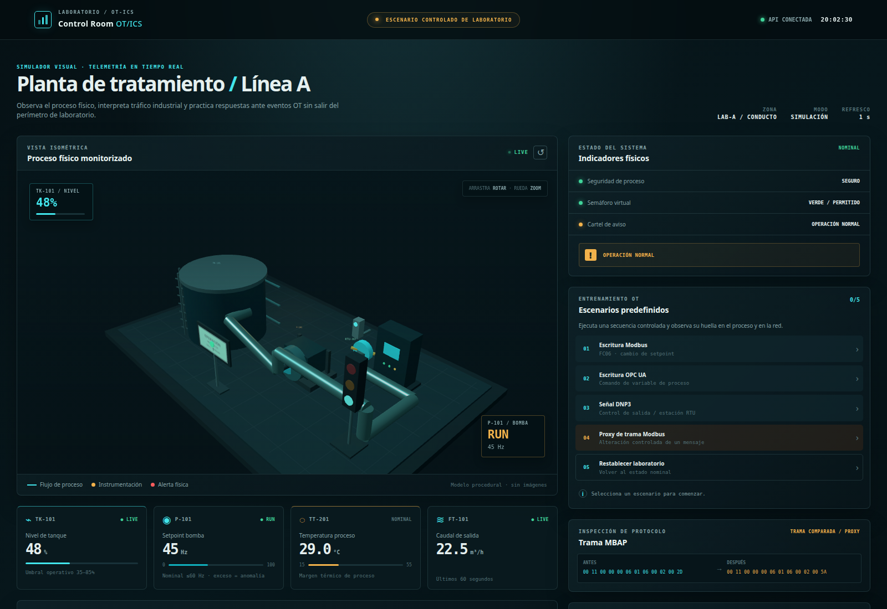
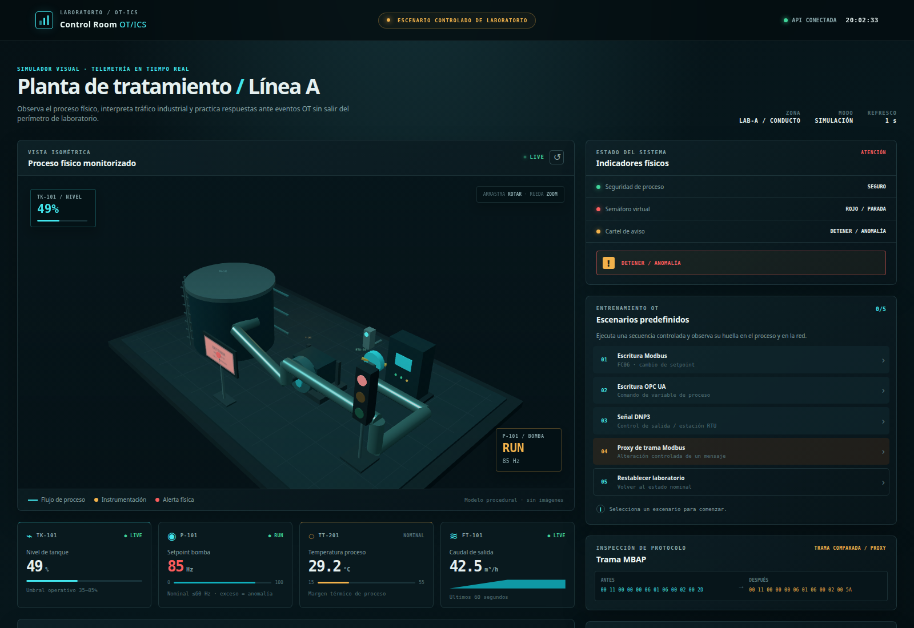

# Laboratorios OT/ICS con Modbus, OPC UA y DNP3

Este repositorio contiene **cuatro laboratorios ejecutables con un solo archivo Docker Compose**. Emula una planta de agua con tanque, bomba, sensores, cartel y semáforo; ofrece una consola 3D en Three.js y permite observar mensajes industriales reales, cambios del proceso y firmas de Suricata. Publica únicamente código, guías de ejecución, capturas de referencia y evidencias reproducibles de los laboratorios.

> **Uso exclusivamente educativo y defensivo.** Ejecute el proyecto en un equipo de práctica, sin conectarlo a una red OT real. Los escenarios generan tráfico únicamente hacia servicios Docker de nombres fijos. No publique `502/TCP`, `4840/TCP` ni `20000/TCP`; no modifique los scripts para dirigirlos a otros equipos. La señal de tráfico y la protección de proceso son simulaciones, no dispositivos ni funciones certificadas.

## Lo que verá el alumno

Al iniciar, la consola presenta una planta en estado nominal. Los botones de la derecha generan transacciones reales Modbus/TCP, OPC UA y DNP3 dentro de la red Docker; la pantalla actualiza los valores cada segundo. El panel **Tráfico en vivo** muestra observaciones de aplicación, mientras que **Riesgos y alertas** distingue eventos analíticos de firmas `engine: Suricata`. Para analizar bytes de red use el PCAP: el panel no pretende sustituir Wireshark.



Después de ejecutar **Señal DNP3** y **Escritura Modbus**, el semáforo aparece rojo, el cartel advierte “DETENER / ANOMALÍA” y la velocidad cambia de 45 a 85 Hz. Esta es la **pantalla esperada** antes de restablecer el proceso:



## Requisitos y arranque

Use Linux **x86_64/amd64**, Docker Engine, el plugin **Docker Compose v2.36+** y al menos **2 GB libres** para imágenes y evidencias. El proyecto usa `interface_name` de Compose para que Suricata capture exactamente `eth1`. Python 3.11, las bibliotecas de protocolos y `tcpdump` se instalan **dentro de la imagen**: el alumno no necesita instalarlos en el anfitrión. Wireshark o Tshark en el anfitrión son opcionales para abrir capturas.

```bash
git clone https://github.com/vtomasv/ot-ics-labs-modbus-opcua-dnp3.git
cd ot-ics-labs-modbus-opcua-dnp3
docker compose version
docker compose up -d
docker compose ps
bash scripts/verify-lab.sh
```

La primera construcción necesita acceso a los repositorios Debian, PyPI y al registro de imágenes de Docker. `docker compose ps` debe mostrar `plant` y `trainer` como **healthy** y `dnp3` y `suricata` como **running**. El script de verificación espera a que operador y RTU respondan y después comprueba cuatro escenarios, una firma Suricata de un FC06 reciente y las tramas antes/después del proxy. La salida termina en `PASS TODOS LOS ESCENARIOS`.

Para reconstruir después de modificar el código, use `docker compose up -d --build`; el primer arranque en un clon limpio **ya construye la imagen** mediante `docker compose up -d`.

El flujo `.github/workflows/compose-ci.yml` repite la construcción y estas comprobaciones en GitHub Actions para cada cambio de la rama `main` y cada pull request. Si falla, consulte su log antes de usar el cambio en un taller.

Abra **http://127.0.0.1:8080/** en el mismo anfitrión. Solo esa API web se publica, vinculada a `127.0.0.1`; los puertos industriales permanecen en Docker. Si `8080` está ocupado, copie `.env.example` a `.env`, cambie `DASHBOARD_PORT` y abra el puerto local elegido. **No cambie el bind de loopback a `0.0.0.0`.** La variable `LAB_TOKEN` del ejemplo es un token de demostración interno, no una credencial de producción.

Para terminar sin borrar evidencias, use `docker compose down`. **`docker compose down -v` elimina los volúmenes `evidence` y `suricata-logs`**; ejecute esa variante solo si realmente quiere perderlos. Los PCAP generados en `pcaps/` no forman parte de esos volúmenes.

## Cuatro prácticas en una sola maqueta

Cada guía en `exercises/` especifica observaciones y criterios de éxito. Use **Restablecer laboratorio** antes de comenzar otra práctica; esta acción reinicia el estado simulado, **no** borra históricos ni PCAP.

| Laboratorio | Acción en la consola | Resultado comprobable |
|---|---|---|
| [01 — Línea base](exercises/ejercicio-1.md) | Observar y capturar tráfico normal | FC03 periódico, topología de flujos, PCAP con Modbus, OPC UA y DNP3 tras activar los escenarios |
| [02 — Integridad Modbus](exercises/ejercicio-2.md) | **Escritura Modbus** y **Proxy de trama Modbus** | FC06 registro 2; 85 y 90 Hz; comparación MBAP/PDU; firma FC06 de Suricata |
| [03 — Escritura OPC UA](exercises/ejercicio-3.md) | **Escritura OPC UA** | `Write` a `Planta/SpeedSetpoint` = 75 Hz; análisis de endpoint `NoSecurity` |
| [04 — Control DNP3](exercises/ejercicio-4.md) | **Señal DNP3** | Control de salida analógica, lectura DNP3 de retorno y semáforo rojo |

El escenario del proxy envía **una trama editada al destino fijo `plant:502`**; no hace ARP spoofing ni intercepción transparente de terceros. OPC UA opera intencionalmente con `SecurityPolicy None` para mostrar una configuración débil y **no** debe presentarse como configuración segura. El control DNP3 de esta maqueta tampoco implementa Secure Authentication. [1] [2]

El cliente Modbus de terminal permite repetir pruebas dentro de la red aislada:

```bash
docker compose exec -T trainer python /lab/scripts/generate-traffic.py --count 5
docker compose exec -T trainer python /lab/scripts/attack-modbus-write.py --lab-only
```

Ambos scripts usan `plant:502` sin argumentos para cambiar el destino. Para obtener un PCAP de **22 segundos** con los escenarios, ejecute `bash scripts/baseline-capture.sh`. El script guarda `pcaps/ot-ics-labs-<fecha>.pcap` y no escucha la red del anfitrión. Puede inspeccionarlo con `tshark -r pcaps/<archivo>.pcap -Y 'modbus || opcua || dnp3'` o abrirlo en Wireshark. También se incluye una captura de referencia en `pcaps/ejemplo-referencia.pcap`.

## Arquitectura y observabilidad

| Servicio | Rol | Visibilidad desde el anfitrión |
|---|---|---|
| `plant` | Gemelo, API, servidor Modbus 502 y servidor OPC UA 4840 | Solo panel HTTP `127.0.0.1:8080` |
| `trainer` | Genera FC03; emite los comandos de los cuatro escenarios | Sin puertos publicados |
| `dnp3` | Estación remota OpenDNP3 en 20000, mismo espacio de red que `plant` | Sin puertos publicados |
| `suricata` | Captura pasiva de `eth1` y alertas EVE JSON | Sin puertos publicados |

La red Docker `control` es `internal: true`; `dashboard` conecta el panel al anfitrión. Esto aproxima un **conducto** de entrenamiento, no una DMZ o zona IEC 62443 certificada. Consulte [arquitectura](docs/arquitectura.md), [escenarios y límites](docs/escenarios-ataque.md), [mapeo MITRE/IEC](docs/mapping-mitre-ics.md) y [diagnóstico](docs/diagnostico.md). El documento de [validación](docs/validacion.md) detalla pruebas reproducibles y límites conocidos.

**Dependencia DNP3:** la estación remota usa `dnp3-python==0.3.0b1`, una distribución cuya versión está marcada *yanked* en PyPI. Fue validada aquí sobre Python 3.11 y Linux amd64, pero **no es apta para producción industrial**; no se promete soporte ARM. El master `dnp3/native_master.py` implementa solo la transacción necesaria para esta maqueta: CRC, comando analógico y lectura de retorno; no es una pila DNP3 general ni soporta fragmentación arbitraria o autenticación segura. Si la rueda deja de estar disponible, la construcción puede fallar: verifique la instalación antes de cada taller.

El modelo de proceso incluye una parada por nivel/temperatura en software para ejercitar observación. **No es un SIS real.** Los eventos del gemelo, el PCAP y las firmas del IDS tienen orígenes distintos: confirme por lo menos dos fuentes antes de atribuir una anomalía.

El visor incorpora Three.js con su aviso de licencia MIT en [`app/static/vendor/THREE-LICENSE.txt`](app/static/vendor/THREE-LICENSE.txt). No se publica un archivo de licencia para el código original del repositorio; el propietario puede elegirla por separado.

## Comprobaciones y solución de problemas

```bash
docker compose config --quiet
docker compose ps
docker compose logs --tail=100 plant trainer dnp3 suricata
bash scripts/verify-lab.sh
curl -fsS http://127.0.0.1:8080/api/health
```

Si el panel abre pero un botón falla, espere a que `trainer` esté **healthy**, revise sus logs y ejecute `verify-lab.sh`. Si el estado cambia pero no aparece una firma IDS, compruebe `docker compose logs suricata`; **no** confunda una alerta analítica con una firma capturada. En algunos anfitriones Linux que mezclan backends `iptables-legacy` y `nftables`, Docker puede bloquear la comunicación entre puentes; la [guía de diagnóstico](docs/diagnostico.md) explica cómo identificarlo sin copiar reglas de firewall ajenas. Nunca aplique `down -v` como primer paso de diagnóstico si necesita conservar evidencia.

## Referencias

[1]: https://reference.opcfoundation.org/specs/OPC-10000-2/4 "OPC UA Part 2: Security Model"
[2]: https://dnp3.github.io/docs/guide/3.0.0/api/outstations/ "OpenDNP3: outstations"
[3]: https://csrc.nist.gov/pubs/sp/800/82/r3/final "NIST SP 800-82 Rev. 3, Guide to Operational Technology Security"
[4]: https://docs.suricata.io/en/latest/rules/modbus-keyword.html "Suricata Modbus rules documentation"
