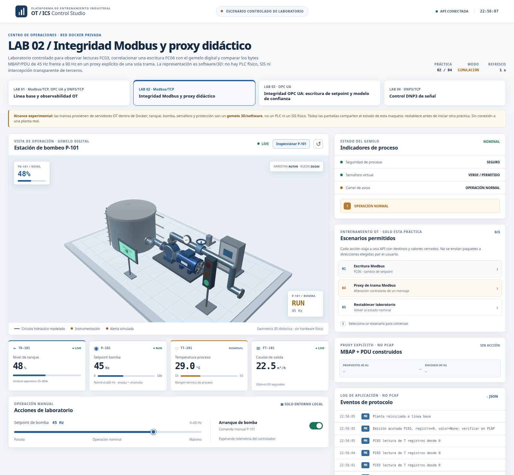

# OT/ICS Labs: cuatro experiencias Modbus, OPC UA y DNP3

**Laboratorios didácticos controlados** sobre una planta de agua virtual. Cada práctica tiene su propia URL, topología declarada, objetivos, pasos ejecutables, panel SCADA/3D, comandos OT acotados, paquete capturado, monitor de alertas, matriz MITRE ATT&CK for ICS y mapeo conceptual IEC 62443. Los tres protocolos viajan por **TCP real entre contenedores Docker**; la bomba, el tanque, el semáforo y la protección son **software simulado**, no hardware industrial ni un SIS certificado.

> **Uso legal y defensivo exclusivamente.** Ejecute esto únicamente en una máquina de enseñanza aislada y autorizada. No conecte el laboratorio a una red OT, PLC, RTU, SIS o infraestructura externa. No publique los puertos 502/TCP, 4840/TCP ni 20000/TCP; no cambie los destinos internos fijos. Los comandos de práctica son una lista blanca de operaciones sobre la maqueta: no hay inyección de bytes arbitrarios, escaneo, DoS, ARP spoofing ni exploit listo para terceros. `SecurityPolicy None` de OPC UA, el token de ejemplo y las reglas simplificadas son debilidades **intencionadas solo para enseñar**, nunca configuraciones de producción.



## Arranque en un comando

Requiere Docker Engine y **Docker Compose v2**, un anfitrión con recursos para la imagen Python y Suricata, acceso a Debian/PyPI/Docker Hub durante la primera construcción y navegador moderno. La rueda de `dnp3-python==0.3.0b1` está marcada *yanked* y solo está disponible para Linux amd64/CPython 3.11; Compose fija `platform: linux/amd64` y en ARM64 necesita emulación (más lenta, no validación nativa). No se requiere Python, Wireshark ni Tshark en el anfitrión para abrir el panel; Wireshark/Tshark son opcionales para analizar PCAP en profundidad.

```bash
git clone https://github.com/vtomasv/ot-ics-labs-modbus-opcua-dnp3.git
cd ot-ics-labs-modbus-opcua-dnp3
docker compose up -d
docker compose ps
bash scripts/verify-lab.sh
python3 scripts/verify-workspaces.py
```

La única publicación del Compose es **`127.0.0.1:8080 → plant:8000`**. Si el puerto está ocupado, copie `.env.example` a `.env` y cambie `DASHBOARD_PORT`, pero conserve el bind de loopback. `plant` y `trainer` deben aparecer **healthy**; `dnp3`, `suricata` y `sensor` deben estar **running**. Si libpcap/tcpdump falla bajo emulación amd64 en ARM, el sensor pasa automáticamente a **AF_PACKET** y sigue produciendo PCAP Ethernet real. `CAPTURE_BACKEND=python` permite forzar este modo para diagnóstico. Abra estas pantallas en el mismo anfitrión:

| Pantalla | Objetivo comprobable | Tráfico / efecto en el gemelo | Guía |
|---|---|---|---|
| [01 — Línea base](http://127.0.0.1:8080/labs/01-baseline) | Reconocer FC03, fuentes de evidencia y flujos normales | FC03 periódico del cliente; OPC UA y DNP3 solo cuando se activan escenarios explícitos | [Pasos y matriz](docs/labs/01-baseline.md) |
| [02 — Integridad Modbus](http://127.0.0.1:8080/labs/02-modbus) | Decodificar MBAP/PDU FC06 y distinguir analítica de firma IDS | Registro 2 → 85/90 Hz, advertencia visual, firma FC06 | [Pasos y matriz](docs/labs/02-modbus.md) |
| [03 — Escritura OPC UA](http://127.0.0.1:8080/labs/03-opcua) | Contrastar Write/Read y política `NoSecurity` | `Planta/SpeedSetpoint` → 75 Hz, proceso visual | [Pasos y matriz](docs/labs/03-opcua.md) |
| [04 — Control DNP3](http://127.0.0.1:8080/labs/04-dnp3) | Interpretar Direct Operate, respuesta y readback | Salida analógica índice 0 → señal virtual roja | [Pasos y matriz](docs/labs/04-dnp3.md) |

La raíz `/` abre la primera práctica. **Las pantallas son independientes, pero la maqueta Docker es compartida**: ejecute *Restablecer* antes de cada práctica/alumno. El reset vuelve al estado nominal (45 Hz, señal verde); **no borra** eventos ni PCAP. Las casillas de los pasos son **autoevaluación local del alumno**, no una nota automática. Exporte la bitácora JSON y guarde el PCAP para comparar dos fuentes independientes.

### Interfaz de operación e inspección mecánica

La consola utiliza una **paleta empresarial clara**, tarjetas de telemetría de alto contraste y un acento discreto propio de cada práctica. La vista del proceso aparece antes del [mapa ampliado](docs/preview-network.png): el operador observa primero el estado, luego traza el conducto Docker y examina el PCAP, las alertas, los pasos y la matriz MITRE. El comparador MBAP/PDU aparece solo en Modbus. Está adaptada a escritorio y móvil. Capturas verificadas: [línea base](docs/preview-01-baseline.png), [Modbus](docs/preview-02-modbus.png), [OPC UA](docs/preview-03-opcua.png), [DNP3](docs/preview-04-dnp3.png) y [pantalla móvil](docs/preview-mobile.png).

En cualquier práctica, pulse **«Inspeccionar P-101»** para acercarse a la [bomba centrífuga modelada](docs/preview-pump-focus.png); **«Vista general»**, **↺** o doble clic devuelve la planta completa. El modelo procedural representa una **bomba horizontal de aspiración axial y descarga vertical** con voluta/bridas atornilladas, motor eléctrico aleteado, ventilador, acople protegido, bancada, válvula y manómetro. El tubo de aspiración sale del tanque y la descarga conduce a la salida de proceso; no hay un retorno hidráulico ficticio. La animación de ventilador/flujo solo aparece con la bomba encendida y velocidad positiva. **No es un CAD de fabricante**, ni modela curva Q-H, rendimiento, presión, inercia, cavitación o tiempos físicos de una bomba: setpoint, temperatura, caudal y nivel pertenecen al gemelo matemático didáctico. Los cambios mostrados después de Modbus/OPC UA/DNP3 provienen del estado de la maqueta y se contrastan con protocolos y PCAP, nunca de un equipo físico.

## Cómo se sigue una práctica

1. Abra la URL de su laboratorio. Lea objetivos y límites, observe la **topología lógica** de nodos y conductos; un enlace se resalta al ver payload capturado en el puerto correspondiente, no por el mero hecho de estar dibujado.
2. Restablezca y registre el estado inicial en la vista SCADA/3D. Pulse **Inspeccionar P-101** si desea examinar el motor, el acople y la voluta antes/después. La HMI muestra nivel `TK-101`, bomba `P-101`, temperatura, caudal, señal y cartel. No es un equipo físico.
3. Siga los pasos de la pantalla o su guía. Los botones predefinidos y el **constructor de comando OT** tienen destinos fijos: Modbus FC03/FC06 en `plant:502`, OPC UA Write en `plant:4840`, DNP3 Direct Operate en `plant:20000`. Rango FC06/OPC UA: 30–95 en el setpoint didáctico; DNP3 solo 0/1/2. El backend impone una pausa de 1,5 s entre comandos del mismo laboratorio.
4. En **Paquetes reales**, seleccione un paquete, compare IP/puertos/hex y descargue el último segmento PCAP. El sensor `tcpdump` está en otro contenedor y captura Ethernet en el conducto de control; el lector web **no reensambla TCP ni descifra OPC UA**. Para analizar completamente use Wireshark/Tshark.
5. Distinga el **log de aplicación** de una firma **`engine: Suricata`** y de los bytes PCAP. `OT-ANOMALY` es una alerta analítica del gemelo; las reglas DNP3 y OPC UA indican presencia de solicitud/HEL, **no** certifican que detectaron una orden o un Write.
6. Registre hora, paquete, función/servicio observado, estado previo/posterior, regla y límite; revise el criterio antes de marcar el paso como documentado. En la matriz MITRE, una conducta **representada** no implica adversario, intrusión ni atribución. Restablezca al terminar sin borrar volúmenes.

### Captura y herramientas de análisis

El sensor (`tcpdump` o su respaldo pasivo AF_PACKET) escribe en el volumen Docker `live-captures` **hasta tres segmentos de 16 MB**; el visor y `/api/capture/download` exponen el más reciente. Para guardar un PCAP propio en `pcaps/` use la captura de referencia del repositorio:

```bash
bash scripts/baseline-capture.sh
# Ejemplo tras crear un archivo de captura:
tshark -r pcaps/<archivo>.pcap -Y 'modbus || opcua || dnp3'
```

`baseline-capture.sh` activa varios escenarios durante 22 s: **su archivo no representa solo tráfico normal**. Para un protocolo único, siga la captura acotada descrita en cada [guía](docs/labs/02-modbus.md). El paquete descargado contiene datos del **conducto Docker**, no solicitudes HTTP del navegador ni una captura de todo el anfitrión. El panel presenta bytes de payload truncados a 192 por fila; abra el PCAP para ver tramas completas y reensamblar el flujo.

## Arquitectura y límites de confianza

| Contenedor | Función y publicación |
|---|---|
| `plant` | API/HMI/gemelo, servidor Modbus 502 y OPC UA 4840; solo HTTP 8000 expuesto al anfitrión en loopback 8080 |
| `trainer` | Cliente FC03 cada 3 s, escenarios de comando y master DNP3; **sin** puertos publicados |
| `dnp3` | Outstation OpenDNP3 en 20000; comparte espacio de red con `plant`, no es un host IP independiente |
| `suricata` | IDS pasivo de la interfaz hacia `trainer`, firmas EVE JSON; sin puerto publicado |
| `sensor` | `tcpdump` pasivo con respaldo AF_PACKET en QEMU, PCAP Ethernet rotativo; sin puerto publicado |

`control` es una red Docker `internal: true`; `dashboard` transporta el acceso web local. Las zonas/conductos de la pantalla son un **modelo de aula**, no una DMZ, separación Purdue real ni certificación IEC 62443. Consulte [arquitectura](docs/arquitectura.md), [escenarios y límites](docs/escenarios-ataque.md), [mapeo MITRE/IEC](docs/mapping-mitre-ics.md), [validación](docs/validacion.md) y [diagnóstico](docs/diagnostico.md).

Cada guía contiene una matriz específica: en Modbus y OPC UA se representa **Modify Parameter (T0836)**; en DNP3 se representa **Manipulation of Control (T0831)**; la línea base incluye lectura de proceso y límites de observación. El proxy Modbus es **una trama creada/editada y enviada a `plant:502`**, no intercepción transparente ni AiTM. FR1–FR7 se usan para proponer controles de identidad, uso, integridad, confidencialidad, flujo restringido, respuesta y disponibilidad **según aplique**; no se infiere SL-T/SL-A ni conformidad. **Ley chilena 21.663** se trata como contexto de gobernanza y reporte según el sujeto obligado; el laboratorio no determina aplicabilidad ni reemplaza revisión legal de texto vigente.

## Verificar, diagnosticar y conservar evidencia

```bash
docker compose config --quiet
docker compose ps
bash scripts/verify-lab.sh
python3 scripts/verify-workspaces.py
docker compose exec -T plant python -m unittest discover -s app/tests
docker compose logs --tail=100 plant trainer dnp3 suricata sensor
curl -fsS http://127.0.0.1:8080/api/packets
```

El primer script prueba los escenarios heredados y una firma FC06 real. El segundo comprueba **las cuatro páginas, sus matrices, acciones cruzadas rechazadas, FC03, FC06, OPC UA y DNP3 con estado y payload PCAP recién capturado, descarga y estabilidad del reset**. Las pruebas unitarias también verifican el filtro del sensor AF_PACKET. Si el panel se desconecta, **no genera tráfico/estados falsos**: consulte [diagnóstico](docs/diagnostico.md). Si la distribución DNP3 yanked deja de estar disponible, el build puede fallar; informe la limitación en vez de sustituirla silenciosamente por HTTP ficticio.

Para parar **sin borrar** evidencia: `docker compose down`. **No use `docker compose down -v` si necesita los volúmenes** `evidence`, `suricata-logs` y `live-captures`. Los PCAP manuales de `pcaps/` son archivos del anfitrión y no se borran con `down`. Solo use `down -v` cuando haya decidido descartar esas evidencias.

## Referencias de base

- [NIST SP 800-82 Rev. 3, Guide to Operational Technology Security](https://csrc.nist.gov/pubs/sp/800/82/r3/final).
- [MITRE ATT&CK for ICS](https://attack.mitre.org/matrices/ics/).
- [OPC UA Security Model](https://reference.opcfoundation.org/specs/OPC-10000-2/4).
- [IEC 62443: visión de estándares, zonas y conductos](https://syc-se.iec.ch/deliveries/cybersecurity-guidelines/security-standards-and-best-practices/iec-62443/).
- [Ley 21.663, Biblioteca del Congreso Nacional de Chile](https://www.bcn.cl/leychile/navegar?idNorma=1202434).

El visor Three.js incluye su aviso de licencia MIT en [`app/static/vendor/THREE-LICENSE.txt`](app/static/vendor/THREE-LICENSE.txt). **Este repositorio no trae licencia para su código original**: su titular debe elegirla expresamente antes de autorizar reutilización por terceros.
